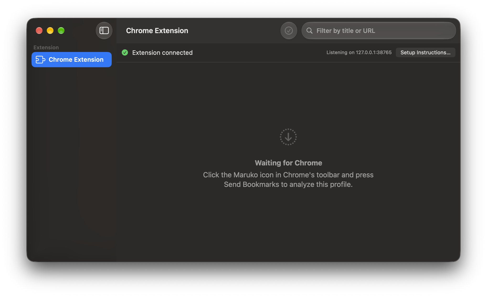

# Maruko

Format and move your browser bookmarks.

Maruko is a macOS app that cleans up bookmarks in the browsers you already use. It works together with a small companion Chrome extension: Maruko analyzes your bookmarks and previews the cleanup, the extension applies the change through Chrome's own `chrome.bookmarks` API. No exporting, no importing, and it works with Chrome running and Sync on, so the cleanup propagates to your other devices too.



## What it does

Maruko manages exactly two folders, which must already exist somewhere in your Chrome bookmarks (Maruko never creates them for you):

- **Recent** (up to 20 links). The bookmarks you've opened most in the last 30 days, most visited first. Bookmarks sitting loose directly on the bookmark bar (not inside a folder) are skipped — being on the bar already means they're used constantly, so pulling them into Recent too would be redundant.
- **Other Bookmarks**. Everything else, left exactly where it is. Its own direct bookmarks and folders are sorted alphabetically; nested subfolders elsewhere are never touched.

Maruko also **removes duplicates**: bookmarks pointing at the same page (trailing slashes, fragments, query order, host case) are collapsed into one, everywhere in the tree.

## How it works

1. In Maruko, select **Chrome Extension** in the sidebar and follow the one-time setup (Maruko installs the extension for you).
2. In Chrome, click the Maruko icon and press **Send Bookmarks**. The extension sends the live bookmark tree and recent history to Maruko.
3. Maruko analyzes it and shows a preview of what would change.
4. Click **Apply via Extension** and confirm. The extension applies the change via `chrome.bookmarks`, so Chrome Sync journals it like any ordinary edit.

See [docs/extension-setup.md](docs/extension-setup.md) for the full setup and day-to-day flow.

## Safety

- Before applying anything, Maruko saves a **snapshot of the tree it received** (last 10 kept) for manual recovery.
- Individual operation failures don't abort the run. They're collected and reported in the summary.
- Enterprise-managed bookmarks are never touched.

## Building

Open `Maruko/Maruko.xcodeproj` in Xcode and run the `Maruko` scheme, or:

```sh
cd Maruko
xcodebuild -scheme Maruko -configuration Debug build   # build
xcodebuild -scheme Maruko test                         # run the tests
```
